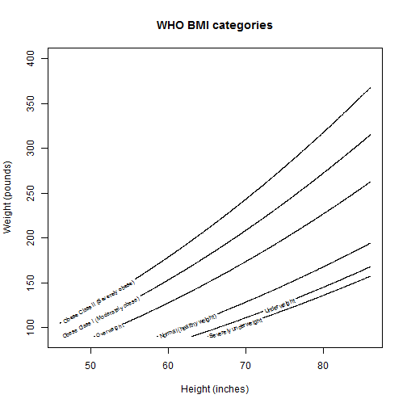

BMI Range
========================================================
author: Jeremy Sellars
date: 9/27/2015

# Do you have a healthy weight?

Body Mass Index (BMI) is a quick approximation of body fat percentage.  Find out more on the [wikipedia page](https://en.wikipedia.org/wiki/Body_mass_index).

========================================================

# It is quick and easy

1. Weigh yourself
2. Measure your height
3. Enter them at https://jeremyrsellars.shinyapps.io/BMI_Range

========================================================

# See your results

========================================================

# How BMI is calculated

BMI (pounds and inches) is

`703 *  Weight / Height * Height`

========================================================

# See the relationship of weight and height to BMI category

BMI (pounds and inches) is `703 *  Weight / Height * Height`, but here is a nice way of visualising the relationship.

 
